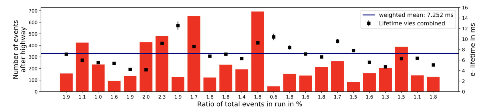

**Event and muon track selection**:
1. select events and tracks according to the output txt file from the [Highway track selection algorithm](../Event-track-selection/HighwayAlgorithm/)

2. additional cut on track-length: take only tracks with more than 50 cm

3. depending on the analysis remmber to remove track hits belonging to corner LEMs (operated at a lower gain). 
keep only 48 < (start point Z) < 248

4. You may want to also remove the channels corresponding to where the extraction grid wires where un-tensed.

5. for computation of electron lifetime keep only tracks which travers anode and cathode

**ADC to charge converstion:** use 55 (ADC x ticks)/fC for view 0 and 67 (ADC x ticks) /fC for view 1.
This is based on charge injection in the range of 14-150 fC during cold operation of the detector. See presentation from July 6th-2018 on indico. 

**Electron lifetime**: use a common value of 7 ms. This is based on best fit to most of the data (see below) and presentation from June 29th-2018 on indico.

**dQ/ds which values to use**
based on the presentation from [July 27](https://indico.cern.ch/event/746969/contributions/3089479/attachments/1694455/2727077/purity311_update.pdf)
use the variable *ds_local_track_direction* for the ds and *Track_Hit_SummedADC* for the value of the integral

**Monte Carlo**: 
See details of productions on the [Twiki](https://twiki.cern.ch/twiki/bin/view/Sandbox/MonteCarloSamples3x1x1)

